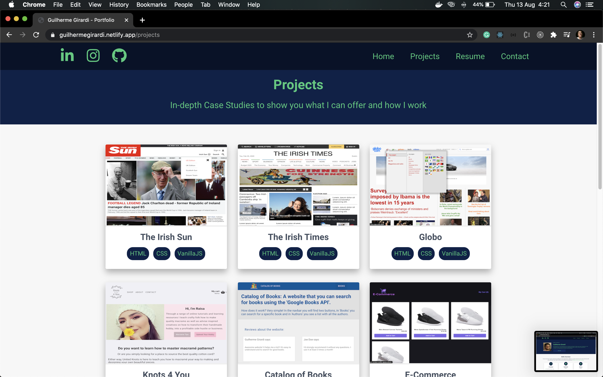
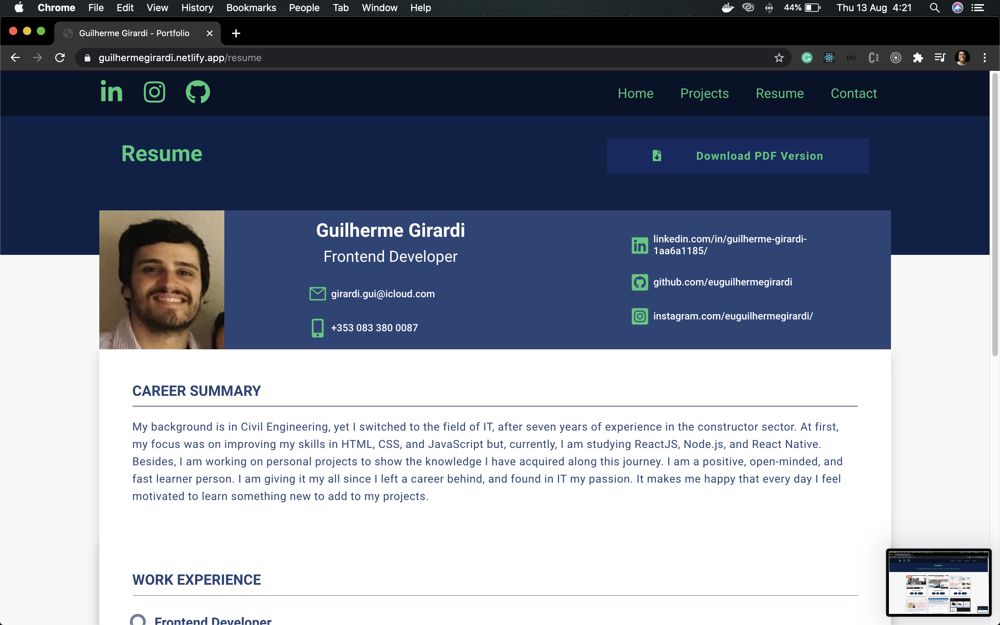
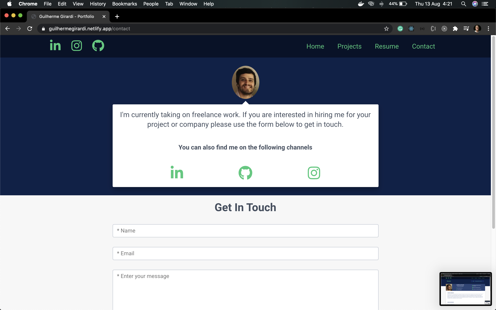

# Portfolio

I created this portfolio to show some projects that I have and not only the code from here.

**Home**

**Projects**

**Resume**

**Contact**

## Getting started

1.  Prerequisites

- npm

      npm install npm@latest -g

2. Installation

- Clone the repo

      git clone https://github.com/euguilhermegirardi/Portfolio.git

3. Install NPM packages

       npm install

4. Run the application

       npm run start

## Contributing

1.  Fork the project
2.  Create your feature branch (`git checkout -b feature/AmazingFeature`)
3.  Commit your changes (`git commit -m 'Add some AmazingFeature'`)
4.  Push to the branch (`git push origin feature/AmazingFeature`)
5.  Open a pull request

## License

